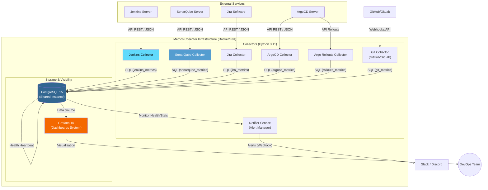

# 🏗️ Arquitectura del Sistema - Metrics Collector

Este documento detalla el diseño técnico, las decisiones de arquitectura y los mecanismos de resiliencia del ecosistema unificado de recolección de métricas.

---

## 🗺️ Diagrama de Arquitectura

El sistema utiliza una arquitectura de microservicios centralizada donde los colectores especializados alimentan un "Data Lake" compartido basado en PostgreSQL.

---

## ⚡ Optimización de Recursos

La principal innovación de esta versión unificada es la **Eficiencia de Recursos**:

*   **Infraestructura Compartida**: En lugar de desplegar una instancia de base de datos por cada colector, se utiliza un único clúster de PostgreSQL que gestiona múltiples bases de datos lógicas (`jenkins_metrics`, `sonarqube_metrics`, `metrics_main`).
*   **Centralización de Logs**: Al correr en un mismo stack, el monitoreo del estado de salud de los colectores se simplifica mediante una única interfaz de logging y orquestación.
*   **Reducción de Overhead**: Menos procesos de sistema operativo corriendo en paralelo, optimizando el uso de RAM y CPU en el host.

---

## 🛠️ Motor de Monitoreo y Resiliencia

El núcleo de los recolectores ha sido diseñado para operar de forma autónoma con alta tolerancia a fallos:

*   **Smart Wait Logic**: Ambos colectores implementan una función `wait_for_services` que impide el inicio del flujo de recolección hasta su respectivo servidor (Jenkins/Sonar) y la base de datos PostgreSQL estén listos.
*   **Garantía de Sincronización**: Los scripts de inicialización SQL (`00-create-databases.sql`) aseguran que las tablas y permisos existan antes de la primera inserción, eliminando errores de "tabla no encontrada".
*   **Self-Healing**: En caso de pérdida de conexión persistente, el motor de polling reintenta la conexión de forma exponencial, evitando el colapso por saturación de peticiones.

---

## 🛡️ Seguridad y Conectividad

*   **Aislamiento de Red**: En Docker Compose, todos los servicios se comunican a través de una red interna (`metrics-net`), exponiendo solo el puerto de Grafana (3000) y Postgres (5432) de forma controlada.
*   **Gestión de Secretos**: No se almacenan credenciales en el código. Toda la autenticación se maneja mediante variables de entorno o Secretos de Kubernetes (`Secret`), inyectados en tiempo de ejecución.
*   **Persistencia Segura**: El uso de volúmenes nombrados y montajes de solo lectura (`ro`) para los scripts de inicialización previene modificaciones accidentales en el esquema de la base de datos desde dentro del contenedor.
*   **Comunicación API**: El uso de `requests.Session` y autenticación `BasicAuth` o `Tokens` asegura que las peticiones a los servidores externos sean eficientes y cifradas.

---

## 🧱 Componentes del Sistema

| Componente | Rol | Tecnología |
| :--- | :--- | :--- |
| **Collectors** | Extraen datos de APIs externas (REST/JSON) y los normalizan. | Python 3.11 + psycopg2 |
| **PostgreSQL** | Almacenamiento persistente con bases de datos aisladas por servicio. | PostgreSQL 15 |
| **Health Check** | Sistema de "Heartbeat" donde cada colector reporta su estado. | SQL (Central DB) |
| **Notifier** | Monitorea la DB en busca de errores y envía alertas. | Python + Webhooks |
| **Grafana** | Visualización multifuente y gestión de alertas. | Grafana 10 |

## 🔄 Flujo de Datos

1.  **Ingesta**: El colector (ej. Jenkins) despierta periódicamente, consulta la API remota y filtra los datos nuevos.
2.  **Persistencia**: Los datos se insertan en su base de datos dedicada (ej. `jenkins_metrics`).
3.  **Salud**: Al finalizar la tarea, el colector actualiza la tabla `collector_status` en la base de datos `metrics_main`.
4.  **Visualización**: Grafana consulta ambas bases de datos:
    *   `metrics_main`: Para el panel de Mission Control (Salud).
    *   `*_metrics`: Para los paneles de métricas específicas (Negocio/Ingeniería).

## 🛡️ Estándares de Implementación

Para asegurar la robustez, todos los colectores siguen este patrón:
1.  **Wait-for-Services**: No inician hasta que Postgres esté listo.
2.  **Data Retention**: Ejecutan una función SQL de limpieza para no saturar el disco.
3.  **Stateless**: Pueden reiniciarse en cualquier momento sin pérdida de datos consistentes.

---

> [!NOTE]  
> Esta arquitectura está lista para escalabilidad horizontal. Se pueden añadir más colectores simplemente añadiendo servicios que apunten a la misma instancia de `metrics-db`.
